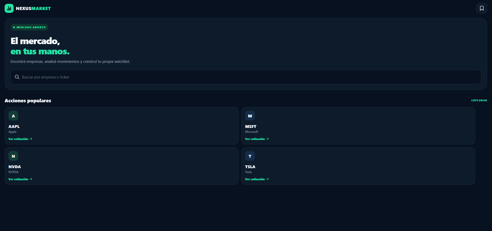
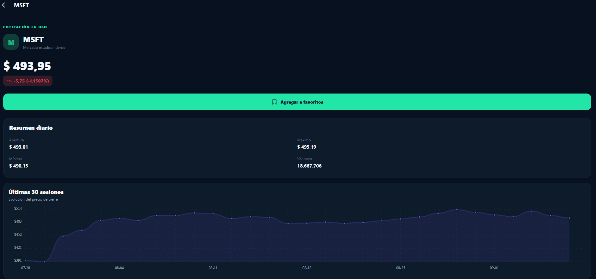
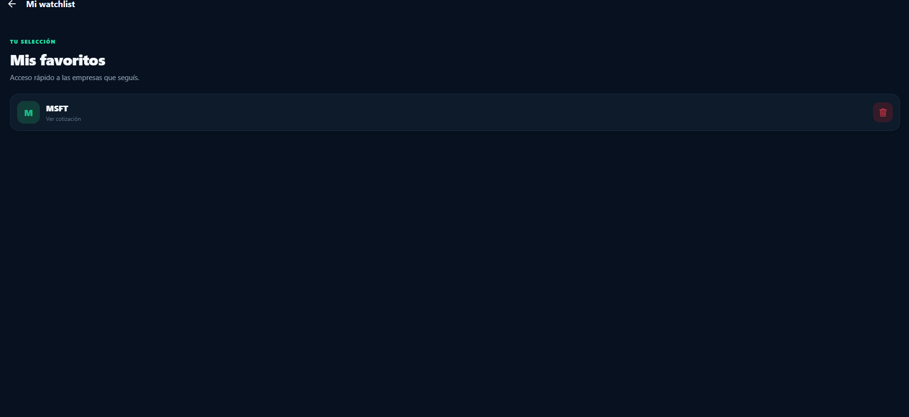

# MarketWatch

Aplicación full-stack de seguimiento bursátil creada con **React Native/Expo**, **TypeScript** y **FastAPI**. El proyecto prioriza una experiencia mobile cuidada, contratos tipados, manejo explícito de errores y una arquitectura fácil de extender.

## Demo

[](docs/media/videos/marketwatch-demo.mp4)

▶️ **[Ver el video de demostración](docs/media/videos/marketwatch-demo.mp4)**

> La reproducción depende del visor del navegador. Si no comienza al abrir el enlace, descargá el archivo MP4 desde esa página.

## Capturas de pantalla

<table>
  <tr>
    <th>Pantalla principal</th>
    <th>Detalle de una acción</th>
  </tr>
  <tr>
    <td></td>
    <td></td>
  </tr>
  <tr>
    <th colspan="2">Watchlist</th>
  </tr>
  <tr>
    <td colspan="2"></td>
  </tr>
</table>

## Funcionalidades

- Búsqueda por ticker o nombre con accesos rápidos a símbolos populares.
- Cotización, variación diaria, volumen e historial de 30 sesiones.
- Watchlist con alta, listado y eliminación de activos.
- Estados de carga, vacío, error y reintento; navegación y controles accesibles.
- Caché TTL thread-safe para reducir latencia y consumo del proveedor.
- Validación de entrada, errores HTTP semánticos, CORS configurable y documentación OpenAPI.
- Suite de pruebas con mocks para health check, validación, watchlist, caché y las
  respuestas del proveedor externo (cotización, búsqueda, histórico y errores).
- Integración continua en GitHub Actions para ejecutar pruebas, lint y typecheck
  en cada push y pull request.

## Arquitectura

```text
mobile/                         backend/
├── App.tsx                    ├── app/
└── src/                       │   ├── cache/       # caché TTL
    ├── api/                   │   ├── core/        # configuración
    ├── screens/               │   ├── models/      # contratos Pydantic
    └── types/                 │   ├── routes/      # endpoints REST
                               │   └── services/    # Alpha Vantage
                               └── tests/
```

El cliente concentra el transporte HTTP en un único módulo con base URL por ambiente, timeout y codificación segura de parámetros. El backend separa rutas, modelos, configuración, caché y acceso al proveedor externo.

La interfaz comparte un sistema visual de colores, superficies y elevación entre
búsqueda, detalle y favoritos. Las operaciones remotas ofrecen estados explícitos
de carga y error, acciones deshabilitadas durante el envío y reintentos accesibles.

## Puesta en marcha

### API

```bash
cd backend
python -m venv .venv
source .venv/bin/activate
pip install -r requirements-dev.txt
cp .env.example .env
# Completar ALPHA_VANTAGE_API_KEY en .env
uvicorn app.main:app --reload
```

### Verificaciones de calidad

```bash
cd backend && python -m pytest -q
cd mobile && npm run typecheck && npm run lint
```

El workflow `.github/workflows/ci.yml` ejecuta las mismas verificaciones en un
entorno limpio. No necesita una API key real: la suite sustituye las respuestas
de Alpha Vantage con mocks deterministas y nunca consume su cuota.

La API queda disponible en `http://localhost:8000`; Swagger UI en `http://localhost:8000/docs`.

### Aplicación

```bash
cd mobile
npm ci
EXPO_PUBLIC_API_URL=http://localhost:8000 npm run web
```

Para un dispositivo físico, `EXPO_PUBLIC_API_URL` debe apuntar a la IP de la computadora en la red local.

## Calidad

```bash
cd mobile && npm run typecheck && npm run lint
cd backend && pytest -q
```

## Decisiones y siguientes pasos

La watchlist y la caché son deliberadamente en memoria para mantener el alcance de MVP: se reinician con el proceso y no se comparten entre workers. Una evolución productiva incorporaría PostgreSQL con usuarios, Redis, autenticación, observabilidad, paginación y CI/CD. Esta limitación está aislada detrás de módulos dedicados para permitir el reemplazo sin cambiar la interfaz móvil.

> Los datos son informativos y pueden tener demora. No constituyen asesoramiento financiero.
